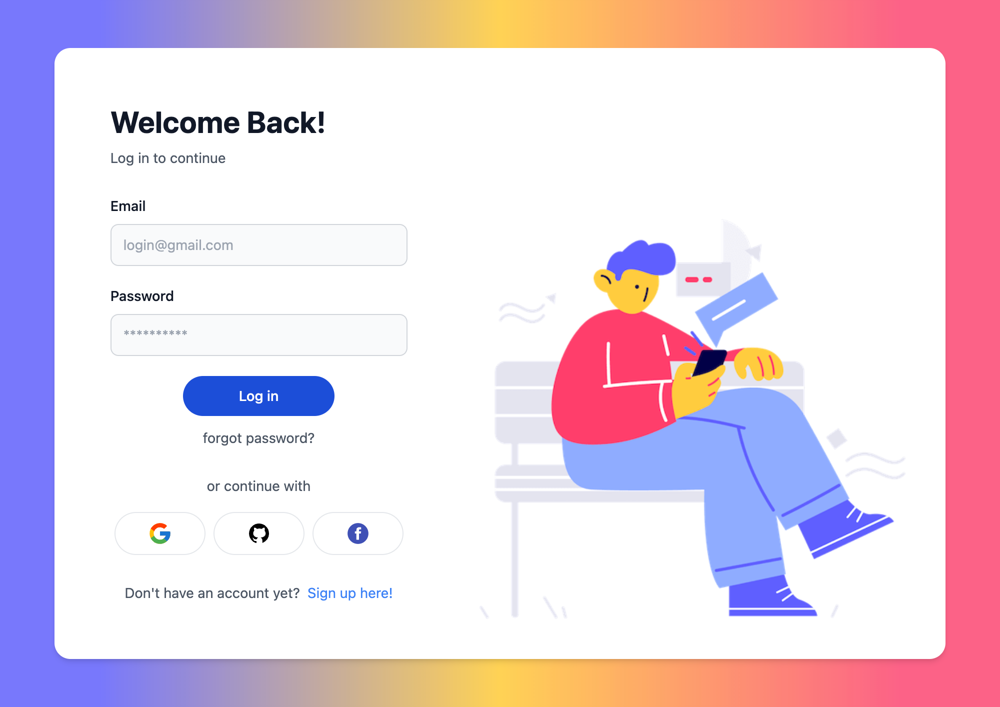
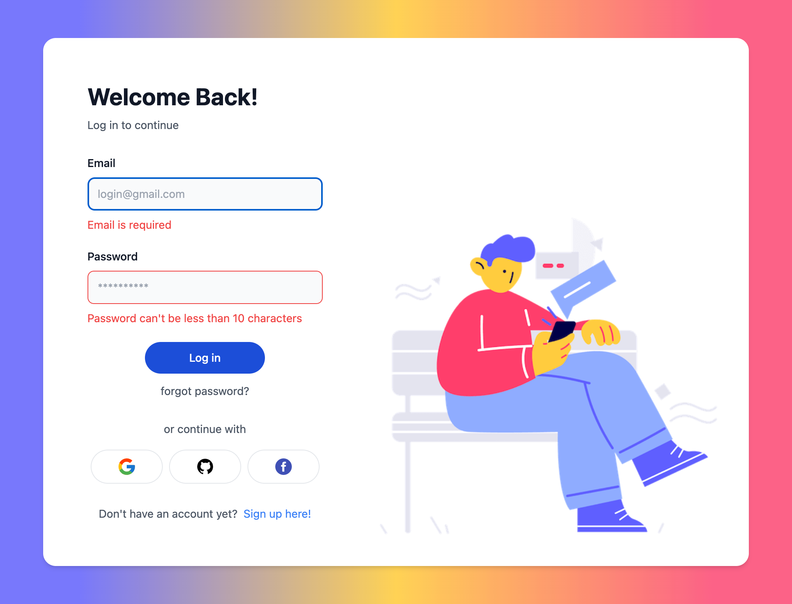
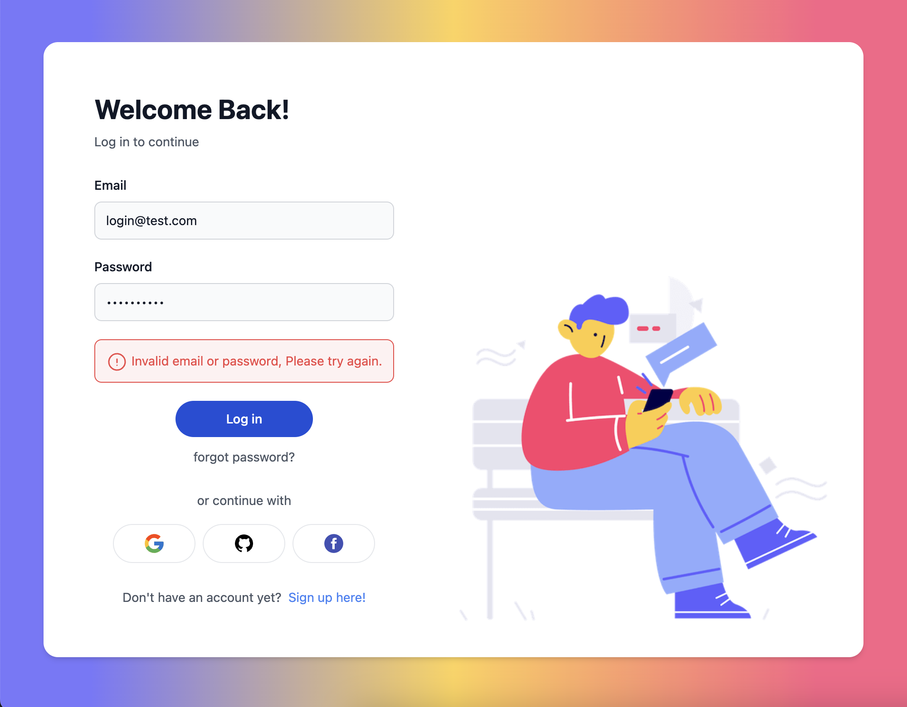
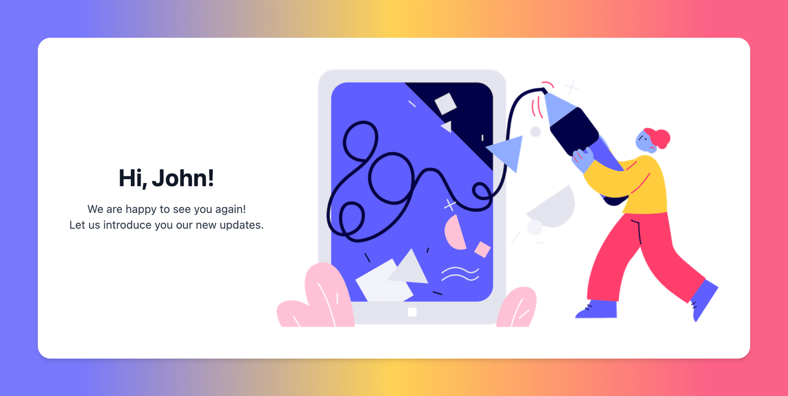
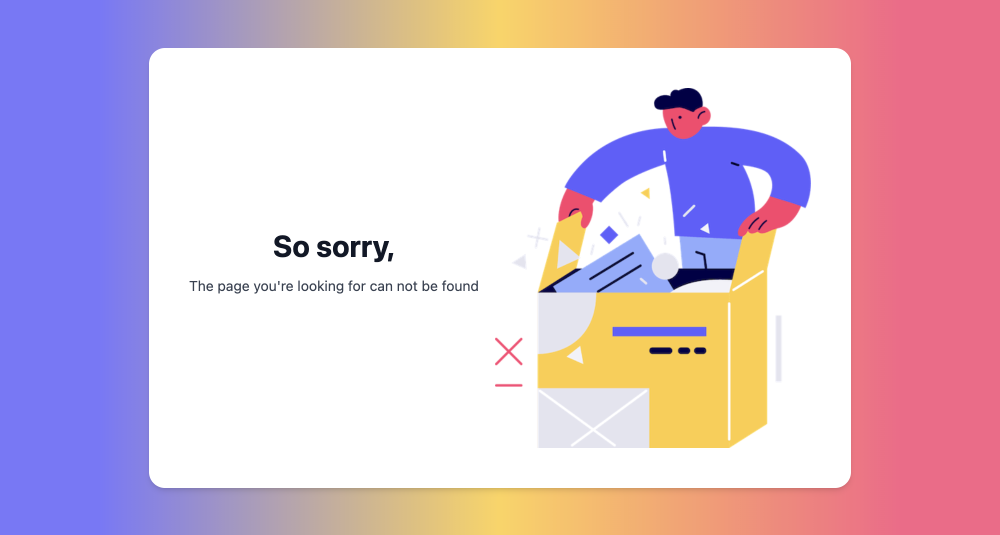

# Login Page

## Features

- User authentication
    - The invalid user is redirected to the login page.
    - The valid user is directed to the successful login page.
- Store the session token in a cookie.
- Handle page not found.
- Implement a responsive design.
 
